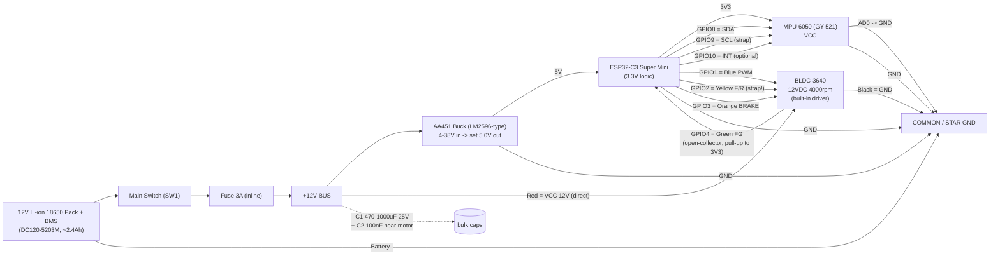

# Wiring & Schematic — Reaction Wheel Balance

เอกสารนี้อธิบายการต่อวงจร (wiring) ทั้งหมดของบอร์ด ESP32-C3 Super Mini, เซ็นเซอร์ MPU-6050 (GY-521), มอเตอร์ BLDC-3640 และระบบไฟ (power tree) ตาม pin assignment ที่ firmware ใช้จริง **ห้ามเปลี่ยนขา GPIO ในตารางหลัก** — ถ้าเจอปัญหาให้อ่านหัวข้อ "Risks" ด้านล่าง ซึ่งมีขาสำรอง (alternative pin) เสนอไว้แล้ว

ดูภาพรวมโปรเจคที่ [`../project-brief.md`](../project-brief.md)

ไดอะแกรม block diagram แบบ SVG (hand-authored, render ได้ใน browser ทุกตัว): [`schematic.svg`](./schematic.svg)

---

## 1. Power Tree

```
[12V Li-ion 18650 Pack + BMS (DC120-5203M, ~2.4Ah)]
        |
        +--- Main Switch (SW1) ---+
                                   |
                              Fuse 3A (inline)
                                   |
                              +12V BUS  ──────────────────────────────┐
                                   |                                  |
                          AA451 Buck (LM2596-type)              (ตรงไปมอเตอร์ ไม่ผ่าน buck)
                          4–38V in → set 5.0V out                     |
                                   |                          C1 470–1000µF/25V
                              ESP32-C3 "5V" pin                 + C2 100nF (ใกล้มอเตอร์)
                                   |                                  |
                          ESP32-C3 onboard 3V3 LDO              BLDC-3640 Red (VCC 12V)
                                   |
                          MPU-6050 VCC (แนะนำใช้ 3V3 ไม่ใช่ 5V)
                                   |
                    ================= COMMON / STAR GND =================
   Battery(–) เป็นจุด star-ground หลัก → Buck GND, ESP32 GND, MPU GND,
   Motor Black(GND), C1/C2 GND ทั้งหมดต่อกลับมาที่บัสนี้เส้นเดียว
```

**หลักการ:**
- แบตเตอรี่ 12V (3S Li-ion + BMS) จ่ายไฟผ่าน **Main Switch** ก่อน แล้วผ่าน **Fuse 3A แบบ inline** (ป้องกันไฟช็อต/มอเตอร์กินไฟเกิน) ก่อนแตกบัส +12V
- บัส +12V แตกเป็น 2 สาย:
  1. เข้า **AA451 buck converter** (4–38V in → ปรับ potentiometer ให้ได้ **5.00V คงที่**) → ไปที่ขา **5V** ของ ESP32-C3 Super Mini (บอร์ดมี onboard regulator แปลง 5V→3.3V ให้เองสำหรับ MCU)
  2. เข้าตรงไปที่มอเตอร์ **BLDC-3640 สายแดง (VCC 12V) โดยตรง ไม่ผ่าน buck** เพราะมอเตอร์กินกระแสสูงตอน start/เร่งความเร็ว การผ่าน buck จะทำให้ buck ทำงานหนักและแรงดันตกได้
- ใกล้จุดจ่ายไฟมอเตอร์ ให้ใส่ **capacitor bank**: อิเล็กโทรไลต์ **470–1000µF 25V (C1)** เพื่อรองรับ current surge ตอนมอเตอร์เร่ง/เบรก + เซรามิก **100nF (C2)** กรอง noise ความถี่สูงจาก commutation ของ BLDC driver ไม่ให้ไปรบกวน I2C/ADC ของ ESP32 และ MPU
- **MPU-6050 (GY-521)** แนะนำเดินสาย VCC จากขา **3V3 ของ ESP32** (ไม่ใช่ 5V) เพราะโมดูล GY-521 มี LDO ในตัวรับได้ 3.3–5V ก็จริง แต่การใช้ 3V3 ตรงจาก ESP32 ทำให้ I/O ระดับ (SDA/SCL/INT) เป็น 3.3V ล้วน ไม่มีความเสี่ยงเรื่อง logic level mismatch
- **Star ground:** จุด (–) ของแบตเตอรี่คือจุดกราวด์อ้างอิงหลัก ทุกโมดูล (buck, ESP32, MPU, มอเตอร์, capacitor) เดินสาย GND กลับมารวมที่บัสเดียวกัน ห้ามให้ GND ของมอเตอร์ (สายดำ, กระแสสูง/มี noise) ไปวน loop ผ่าน GND ของ MPU (สัญญาณอ่อน) — ให้จุดเชื่อมเป็นรูปดาว (star) ไม่ใช่ daisy-chain ผ่านกันไปมา

---

## 2. Pin Table (ตัวจริงที่ firmware ใช้ — ห้ามเปลี่ยน)

| Signal | ESP32-C3 GPIO | สายสี (wire color) | Direction | Voltage level | หมายเหตุ |
|---|---|---|---|---|---|
| I2C SDA | **GPIO8** | — (jumper wire, ไม่มีสีมาตรฐาน) | ESP32 ↔ MPU (bidirectional, open-drain) | 3.3V | strapping pin ของ ESP32-C3 แต่ I2C pull-up (มักมีในตัว GY-521 หรือเพิ่มเอง 4.7k) ทำให้ high ตอน boot ซึ่งปลอดภัย |
| I2C SCL | **GPIO9** | — | ESP32 → MPU (output) | 3.3V | strapping pin (BOOT select) — I2C pull-up ทำให้ high ตอน boot = ปลอดภัย, **ห้ามต่อ pull-down หรืออุปกรณ์ที่ดึงขา 9 ลง GND ตอน power-up** |
| MPU INT (ใหม่, optional) | **GPIO10** | — | MPU → ESP32 (input) | 3.3V | ไม่บังคับต้องใช้ (โค้ด polling ก็ได้), เดินสายไว้เผื่ออนาคต |
| MPU AD0 | ต่อ **GND** ตรง (ไม่ผ่าน GPIO) | — | address select | — | ผูกลง GND เพื่อ address 0x68 |
| MPU VCC | ESP32 **3V3** pin | — | power in | 3.3V | แนะนำใช้ 3V3 ของ ESP32 ไม่ใช่ 5V (ดูหัวข้อ Power Tree) |
| MPU GND | Common GND | — | power | — | รวมที่ star ground bus |
| Motor PWM (ความเร็ว) | **GPIO1** | **Blue (น้ำเงิน)** | ESP32 → Motor (output) | 3.3V (จาก ESP32) เข้าไดร์เวอร์ที่รับ 5V logic | ดู risk (b) เรื่อง pull-up 5V ย้อนกลับ |
| Motor F/R (ทิศทาง CW/CCW) | **GPIO2** | **Yellow (เหลือง)** | ESP32 → Motor (output) | 3.3V → 5V-logic driver | **strapping pin — ดู risk (a)**, ทางเลือก GPIO5/6/7 |
| Motor BRAKE | **GPIO3** | **Orange (ส้ม)** | ESP32 → Motor (output) | 3.3V → 5V-logic driver | ดู risk (b) |
| Motor FG (speed pulse output) | **GPIO4** | **Green (เขียว)** | Motor → ESP32 (input) | open-collector, ต้องมี pull-up ไป 3.3V | ใหม่ (เพิ่มจากเดิม) — ใส่ตัวต้านทาน pull-up 4.7–10kΩ จาก GPIO4 ไป 3V3 (ห้ามลืม ไม่งั้นอ่านค่าไม่ได้/ค้าง) |
| Motor VCC | Battery **+12V ตรง** (ไม่ผ่าน buck) | **Red (แดง)** | power in | 12V | ต่อหลัง fuse ตรงจากบัส +12V |
| Motor GND | Common GND | **Black (ดำ)** | power | — | รวมที่ star ground bus |
| ESP32 5V pin | Buck (AA451) output | — | power in | 5.0V (ปรับ trim pot ให้แน่นอน) | **ตั้ง 5.0V ด้วยมัลติมิเตอร์ก่อนต่อ ESP32 เสมอ** |
| ESP32 3V3 pin | onboard LDO output | — | power out | 3.3V | ใช้จ่าย MPU VCC + จุด pull-up ของ FG |
| ESP32 GND | Common GND | — | power | — | รวมที่ star ground bus |

หมายเหตุ: คอลัมน์ "สายสี" อ้างอิงสายมอเตอร์ตัวจริง 6 เส้นของ BLDC-3640 (แดง/ดำ/น้ำเงิน/เหลือง/ส้ม/เขียว) ส่วนสาย MPU/jumper wire ไม่มีมาตรฐานสี ให้ดูจาก label บนโมดูลแทน

---

## 3. ลำดับขั้นตอนการต่อสาย (Wiring Order)

ทำตามลำดับนี้ **ห้ามข้ามขั้นตอน** เพื่อความปลอดภัยของบอร์ดและมอเตอร์:

1. **ปิดสวิตช์ (SW1) และไม่เสียบแบตเตอรี่ก่อน** ต่อวงจรทั้งหมดบนโต๊ะโดยยังไม่มีไฟเข้า
2. เดินสาย **battery(+) → SW1 → Fuse 3A → +12V bus** ตรวจสอบขั้ว (polarity) ให้ถูกต้อง แบตเตอรี่ Li-ion กลับขั้วจะเสียหายหรืออันตรายทันที
3. เดินสาย **+12V bus → AA451 buck input**, และ **+12V bus → BLDC-3640 สายแดง (VCC)** โดยตรง (คนละสายจากขา buck)
4. ใส่ **C1 (470–1000µF/25V) + C2 (100nF)** คู่กัน ให้ใกล้จุดรับไฟของมอเตอร์ที่สุด ขา (+) ของ C1 ต้องตรงกับขั้ว +12V (electrolytic มีขั้ว ต่อผิดขั้วระเบิดได้)
5. เดินสาย **GND ทั้งหมด** (battery–, buck GND, ESP32 GND, MPU GND, motor สายดำ, C1/C2 GND) กลับมาที่จุด star ground เดียวกัน (แนะนำจุดเดียวที่ battery– หรือบัสสั้น ๆ ใกล้กัน)
6. **เปิดสวิตช์ SW1 โดยที่ยังไม่ต่อ ESP32/MPU/motor control เข้ากับ buck output** — ใช้มัลติมิเตอร์วัดที่ output ของ AA451 แล้วปรับ trim pot จนได้ **5.00V ± 0.05V พอดี** ก่อนเท่านั้น จากนั้นปิดสวิตช์
7. ต่อ **buck output → ESP32-C3 5V pin**
8. ต่อ **MPU-6050**: VCC → ESP32 3V3, GND → common GND, SDA → GPIO8, SCL → GPIO9, INT → GPIO10 (ถ้าใช้), AD0 → GND
9. ต่อสายควบคุมมอเตอร์: Blue(PWM) → GPIO1, Yellow(F/R) → GPIO2, Orange(BRAKE) → GPIO3, Green(FG) → GPIO4 **ผ่านตัวต้านทาน pull-up 4.7–10kΩ ไป 3V3** (ถ้าจำเป็นตามความเสี่ยง (b) ให้ใส่ level-shift stage ตามที่อธิบายในหัวข้อ Risks ก่อน)
10. ตรวจสอบทุกจุดเชื่อมต่อด้วยสายตาอีกครั้ง (โดยเฉพาะขั้วแบตเตอรี่ + จุด GND ทั้งหมดต่อกันจริง) แล้วจึงเปิดสวิตช์เพื่อทดสอบ
11. **ยึดล้อ (flywheel) ให้แน่น หรือถอดล้อออกก่อน** แล้วรัน firmware `motor_test` เพื่อตรวจสอบ polarity ของ PWM/F-R/BRAKE ก่อนต่อล้อจริงและทดสอบระบบ balance

### Pre-Power-On Checklist

ก่อนเปิดสวิตช์ทุกครั้งที่ต่อวงจรใหม่หรือแก้ไขวงจร ให้เช็คทีละข้อ:

- [ ] ตั้งค่า AA451 buck ให้ได้ **5.00V ด้วยมัลติมิเตอร์** ก่อนต่อเข้า ESP32 (ห้ามเดา ห้ามใช้ค่า default จากโรงงาน)
- [ ] ตรวจขั้ว (+/–) ของแบตเตอรี่ และของ C1 (electrolytic มีขั้ว) ว่าต่อถูกทาง
- [ ] Fuse 3A อยู่ในวงจรจริง (inline บนสาย +12V หลัง switch)
- [ ] ทุกจุด GND ต่อกลับมาที่ star ground bus เดียวกัน ไม่มี GND ลอย (floating)
- [ ] สาย motor แดง/ดำ ต่อตรงกับ +12V bus / GND โดยตรง ไม่ได้ไปผ่าน buck โดยไม่ตั้งใจ
- [ ] pull-up resistor ของ FG (GPIO4) ต่อครบแล้ว (4.7–10kΩ ไป 3V3)
- [ ] AD0 ของ MPU ต่อ GND แล้ว (address 0x68)
- [ ] ล้อ (flywheel) ยึดแน่นหรือถอดออก/หนีบ (clamp) แน่นก่อนทดสอบครั้งแรก, สวมแว่นตากันสะเก็ด (eye protection)
- [ ] ไม่มีสายหลุด/ลัดวงจรที่มองเห็นได้ ก่อนเปิดสวิตช์จริง

---

## 4. Mermaid Block Diagram



---

## 5. Risks — ความเสี่ยงและข้อควรระวัง

### (a) ESP32-C3 Strapping Pins: GPIO2 / GPIO8 / GPIO9

บอร์ด ESP32-C3 ใช้ GPIO2, GPIO8, GPIO9 เป็น **strapping pins** ที่มีผลต่อโหมด boot:
- **GPIO9 = BOOT select.** ถ้าขานี้ถูกดึงลง (low) ตอน power-on/reset, ชิปจะเข้าโหมด UART download (flash) แทนที่จะบูตโปรแกรมปกติ — ในวงจรนี้ GPIO9 ใช้เป็น I2C SCL ซึ่งมี pull-up (จาก I2C bus หรือ MPU module) ทำให้ high อยู่แล้วตอน boot ⇒ **ปลอดภัย ไม่ต้องแก้**
- **GPIO8** บนบอร์ด Super Mini มักมี onboard LED ต่อร่วมอยู่ (บาง revision), ใช้เป็น I2C SDA ก็มี pull-up ช่วยให้ high ตอน boot ⇒ โดยทั่วไปปลอดภัย แต่ถ้าเจอ LED กะพริบแปลก ๆ ตอน I2C ทำงาน หรือบอร์ดไม่บูต ให้สงสัยจุดนี้ก่อน
- **GPIO2** ในวงจรนี้ใช้เป็น **motor F/R (ทิศทาง)** — สายเหลืองของมอเตอร์ (ซึ่งมักมี internal pull-up ในตัวไดร์เวอร์มอเตอร์) **อาจดึงขา GPIO2 ไปในทิศทางที่ไม่คาดคิดตอน power-up/reset** (ก่อนที่ firmware จะ set pin เป็น output) ⇒ **อาการที่จะเจอ: ESP32 บูตไม่ขึ้น, boot loop, หรือ error ทาง serial ตอน reset**

**ทางแก้/ขาสำรอง:** ถ้าพบอาการบูตแปลกหลังต่อสาย F/R เข้า GPIO2 ให้ย้ายสัญญาณ F/R ไปที่ **GPIO5, GPIO6 หรือ GPIO7** แทน (เป็น GPIO ทั่วไป ไม่ใช่ strapping pin) แล้วอัปเดต firmware ให้ตรงกัน — ตารางหลักในเอกสารนี้ยังคง GPIO2 ไว้เป็นค่า default ตามที่ทีม firmware ใช้ แต่ให้บันทึกไว้ว่านี่คือจุดที่ต้องทดสอบจริงก่อน

### (b) Motor Control Inputs อาจมี Internal Pull-up ไป 5V — เสี่ยง Back-feed เข้า GPIO 3.3V

มอเตอร์ BLDC ที่มี built-in driver แบบนี้ (BLDC-3640) มักออกแบบขา PWM/F-R/BRAKE เป็น **input ที่ pull-up ไปที่ 5V ภายในตัวไดร์เวอร์** (logic แบบ active-low ผ่านการดึงลง GND) ผลคือ:
- เวลา GPIO ของ ESP32 ตั้งเป็น **output แล้ว drive HIGH (3.3V)** ปกติไดร์เวอร์จะยังอ่านเป็น high ได้ (เพราะ 3.3V > threshold high ของ 5V logic ส่วนใหญ่) — จุดนี้มักไม่มีปัญหา
- แต่ถ้า GPIO ถูกตั้งเป็น **input ชั่วคราว** (เช่นตอน boot ก่อน `pinMode()` หรือระหว่าง reset) internal pull-up 5V ของมอเตอร์จะ **ย้อนกลับเข้ามาที่ขา GPIO ได้เต็ม ๆ** ซึ่งเกินค่า absolute max ของ ESP32-C3 GPIO (~3.6V) ⇒ **เสี่ยงทำให้ GPIO เสียหายถาวรได้ในระยะยาว**

**คำแนะนำ:** ใส่ **ตัวต้านทานอนุกรม 1kΩ** ระหว่าง GPIO กับสายควบคุมมอเตอร์ (จำกัดกระแสไม่ให้เสียหาย) เป็นวิธีง่ายที่สุด หรือถ้าต้องการความปลอดภัยสูงขึ้น ให้ทำ **open-drain level-shift stage ด้วย NPN (เช่น 2N2222) หรือ N-MOSFET (เช่น 2N7000)** ต่อแบบ:

```
ESP32 GPIO --[1kΩ]-- Base/Gate
                         |
        Collector/Drain -+--- ต่อเข้าสายควบคุมมอเตอร์ (ที่มี pull-up 5V ในตัว)
                         |
          Emitter/Source -+--- GND
```

วิธีนี้ GPIO **ไม่เห็นแรงดัน 5V เลย** เพราะ transistor ทำหน้าที่ pull-down เท่านั้น (ดูรูปประกอบในหัวข้อ "Detail: one channel open-drain level-shift" ใน `schematic.svg`)

**ข้อควรรู้:** วิธี open-drain นี้ **กลับ logic (invert)** — GPIO HIGH จะทำให้สายมอเตอร์ถูกดึง LOW (active), GPIO LOW จะทำให้สายลอย HIGH ผ่าน pull-up ของมอเตอร์ (inactive) ดังนั้น **firmware ต้องมี invert flag ต่อ channel** เพื่อชดเชย logic ที่กลับด้าน ถ้าใช้วิธีนี้กับ PWM/F-R/BRAKE ตัวใดตัวหนึ่งหรือทั้งหมด

### (c) Polarity ของ PWM / F-R / BRAKE ไม่มีเอกสารจากผู้ผลิต — ต้องทดสอบเอง

BLDC-3640 ไม่มี datasheet ที่ระบุ logic ชัดเจนว่า HIGH หรือ LOW แปลว่าอะไรในแต่ละขา (เช่น BRAKE=HIGH คือเบรกทำงาน หรือ LOW คือเบรกทำงาน, F/R=HIGH คือ CW หรือ CCW) **ต้องตรวจสอบด้วย firmware's `motor_test` sketch จริงเท่านั้น**

**ก่อนทดสอบทุกครั้ง: ถอดล้อ (flywheel) ออก หรือหนีบ/clamp โครง U ให้แน่นกับโต๊ะ** ห้ามทดสอบขณะล้อยังหมุนได้เสรีและไม่มีการยึดโครง เพราะถ้า direction/brake ทำงานผิดที่คาดไว้ (เช่นสั่งกลับทิศทันทีตอนความเร็วสูง) อาจทำให้โครง/ล้อกระแทกหรือหลุดได้

### (d) ความปลอดภัยของล้อเหวี่ยง (Wheel Safety)

ล้อพิมพ์ 3D เส้นผ่านศูนย์กลาง 20 cm หมุนด้วยความเร็วสูงสุดของมอเตอร์ถึง **4000 rpm** (ลดตามอัตราทดเฟือง/สายพานที่ฐานอีกที) ความเสี่ยงที่ต้องระวัง:
- **Balance:** ล้อที่พิมพ์ 3D ไม่ balance สมบูรณ์แบบจะสั่นแรงขึ้นตามความเร็วรอบ (vibration ∝ rpm²) ควร balance ล้อ (ถ่วงน้ำหนัก/เจียร) ก่อนทดสอบความเร็วสูง
- **สกรู/bolts:** ตรวจ torque ของสกรูยึดล้อกับ hub/มอเตอร์ทุกครั้งก่อนทดสอบ ล้อหลุดขณะหมุนเร็วเป็นอันตรายรุนแรง
- **อุปกรณ์ป้องกัน:** สวมแว่นตากันสะเก็ด (eye protection) เสมอเมื่อทดสอบความเร็วสูง และยืนห่าง/มีที่กำบัง (shield) ระหว่างตัวกับล้อถ้าเป็นไปได้
- **ห้ามสลับทิศทาง (F/R) ทันทีขณะล้อหมุนความเร็วสูง** — การกลับทิศกะทันหันทำให้เกิด reaction torque/กระแสสูงมาก อาจทำให้มอเตอร์/เฟือง/สกรูเสียหาย หรือล้อหลุดได้ ให้ลดความเร็วเป็น 0 หรือใช้ BRAKE ก่อนเปลี่ยนทิศเสมอ

### (e) แบตเตอรี่: ห้ามใช้ต่ำกว่า ~9V (3S)

แบตเตอรี่เป็น Li-ion 3S (12V nominal, DC120-5203M มี BMS ในตัว) เซลล์ Li-ion แต่ละเซลล์ไม่ควรถูกดึงแรงดันต่ำกว่า ~3.0V/เซลล์ ⇒ แรงดันรวมทั้งแพ็ค **ไม่ควรต่ำกว่าประมาณ 9V** แม้ว่า BMS จะมีวงจรป้องกัน over-discharge อยู่แล้ว (จะตัดไฟอัตโนมัติ) แต่ควร**เฝ้าสังเกตแรงดันด้วยมัลติมิเตอร์หรือวัดผ่านโค้ด**เป็นระยะ ไม่ปล่อยให้ BMS ตัดบ่อย ๆ เพราะจะลดอายุการใช้งานเซลล์ในระยะยาว

---

## สรุปรายการอุปกรณ์เสริมที่ต้องเตรียมเพิ่ม (นอกจาก BOM เดิม)

| อุปกรณ์ | ค่า/สเปคแนะนำ | ใช้ที่ไหน |
|---|---|---|
| Main switch (SW1) | rated ≥3A, 12V DC | ระหว่างแบตเตอรี่กับ fuse |
| Fuse (inline) | 3A, blade หรือ glass fuse + holder | ระหว่าง switch กับ +12V bus |
| Electrolytic capacitor C1 | 470–1000µF, 25V | ใกล้จุดจ่ายไฟมอเตอร์ (สาย +12V ↔ GND) |
| Ceramic capacitor C2 | 100nF, 25–50V | คู่กับ C1 ใกล้มอเตอร์ |
| Pull-up resistor (FG) | 4.7–10kΩ | ระหว่าง GPIO4 กับ 3V3 |
| Series resistor (motor control, ถ้าต้องใช้) | 1kΩ | ระหว่าง GPIO1/2/3 กับสายมอเตอร์ (ดู risk b) |
| NPN/MOSFET (ถ้าต้องใช้ open-drain stage) | 2N2222 หรือ 2N7000 | 1 ตัวต่อ channel ที่ต้อง level-shift |
