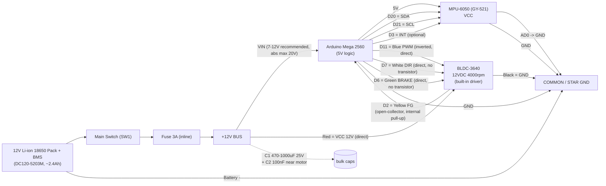

# Wiring & Schematic — Reaction Wheel Balance

เอกสารนี้อธิบายการต่อวงจร (wiring) ทั้งหมดของบอร์ด **Arduino Mega 2560**, เซ็นเซอร์ MPU-6050 (GY-521), มอเตอร์ BLDC-3640 และระบบไฟ (power tree) ตาม pin assignment ที่ firmware ใช้จริง (`firmware/reaction_wheel_balance/config.h`) **ห้ามเปลี่ยนขาในตารางหลัก** — ถ้าเจอปัญหาให้อ่านหัวข้อ "Risks" ด้านล่าง

> **เปลี่ยนคอนโทรลเลอร์เป็น Arduino Mega 2560 (2026-09-19, ถาวร)** — เดิมออกแบบไว้กับ ESP32-C3 Super Mini แต่พบว่าขา DIR/BRAKE ของไดร์เวอร์ BLDC-3640 เป็น 5V logic ที่มี pull-up แรง (~1kΩ) ทำให้ ESP32 (3.3V) ดึงลง LOW ผ่าน R อนุกรมไม่ได้ ต้องใช้ NPN ช่วย เมื่อเปลี่ยนมาใช้ Mega (5V logic) แล้วต่อตรงได้เลยไม่ต้องมีทรานซิสเตอร์ ผลพลอยได้อีกอย่างคือหมดปัญหา strapping pin ของ ESP32-C3 (GPIO2/8/9) และปัญหาไฟย้อนที่ขา USB-5V กับ buck (ดูหัวข้อ Risks) เฟิร์มแวร์พอร์ตเสร็จแล้ว (`firmware/reaction_wheel_balance/`), เวอร์ชัน ESP32 เดิมย้ายไปเก็บที่ `firmware/legacy_esp32/`

ดูภาพรวมโปรเจคที่ [`../project-brief.md`](../project-brief.md)

ไดอะแกรม block diagram แบบ SVG (hand-authored, render ได้ใน browser ทุกตัว): [`schematic.svg`](./schematic.svg)

---

## 1. Power Tree

```
[12V Li-ion 18650 Pack + BMS (DC120-5203M, ~2.4Ah)]
        |
        +--- Main Switch (SW1) ---+
                                   |
                              Fuse 3A (inline)
                                   |
                              +12V BUS  ──────────────────────────────┐
                                   |                                  |
                          Arduino Mega 2560 VIN pin              (ตรงไปมอเตอร์ ไม่ผ่านตัวลดแรงดันใด ๆ)
                          (onboard regulator, 7-12V recommended,       |
                           แพ็ค 3S เต็ม ~12.6V ใช้ได้ abs.max 20V)  C1 470–1000µF/25V
                                   |                          + C2 100nF (ใกล้มอเตอร์)
                          Mega onboard 5V regulator                   |
                                   |                          BLDC-3640 Red (VCC 12V)
                          MPU-6050 VCC (ใช้ Mega 5V ได้เลย
                          โมดูลมี LDO 3.3V ในตัว)
                                   |
                    ================= COMMON / STAR GND =================
   Battery(–) เป็นจุด star-ground หลัก → Mega GND, MPU GND,
   Motor Black(GND), C1/C2 GND ทั้งหมดต่อกลับมาที่บัสนี้เส้นเดียว
```

**หลักการ:**
- แบตเตอรี่ 12V (3S Li-ion + BMS) จ่ายไฟผ่าน **Main Switch** ก่อน แล้วผ่าน **Fuse 3A แบบ inline** (ป้องกันไฟช็อต/มอเตอร์กินไฟเกิน) ก่อนแตกบัส +12V
- บัส +12V แตกเป็น 2 สาย:
  1. เข้า **ขา VIN ของ Arduino Mega 2560 โดยตรง** — Mega มี onboard voltage regulator แปลง VIN → 5V ให้เอง (สเปคแนะนำ 7–12V, abs. max 20V) แบตเตอรี่ 3S เต็มที่ ~12.6V ยังอยู่ในช่วงที่ใช้ได้ปลอดภัย **ไม่ต้องมีตัวลดแรงดัน (buck converter) อีกต่อไป**
  2. เข้าตรงไปที่มอเตอร์ **BLDC-3640 สายแดง (VCC 12V) โดยตรง** เพราะมอเตอร์กินกระแสสูงตอน start/เร่งความเร็ว
- ใกล้จุดจ่ายไฟมอเตอร์ ให้ใส่ **capacitor bank**: อิเล็กโทรไลต์ **470–1000µF 25V (C1)** เพื่อรองรับ current surge ตอนมอเตอร์เร่ง/เบรก + เซรามิก **100nF (C2)** กรอง noise ความถี่สูงจาก commutation ของ BLDC driver ไม่ให้ไปรบกวน I2C/ADC ของ Mega และ MPU
- **MPU-6050 (GY-521)** ต่อ VCC เข้าขา **5V ของ Mega โดยตรง** (โมดูล GY-521 มี LDO 3.3V ในตัวรับ 3.3–5V ได้อยู่แล้ว) ขา I/O (SDA/SCL) ของ Mega ก็เป็น 5V logic level ตรงกับโมดูลพอดี ไม่มีปัญหา level mismatch
- **Star ground:** จุด (–) ของแบตเตอรี่คือจุดกราวด์อ้างอิงหลัก ทุกโมดูล (Mega, MPU, มอเตอร์, capacitor) เดินสาย GND กลับมารวมที่บัสเดียวกัน ห้ามให้ GND ของมอเตอร์ (สายดำ, กระแสสูง/มี noise) ไปวน loop ผ่าน GND ของ MPU (สัญญาณอ่อน) — ให้จุดเชื่อมเป็นรูปดาว (star) ไม่ใช่ daisy-chain ผ่านกันไปมา

---

## 2. Pin Table (ตัวจริงที่ firmware ใช้ — ห้ามเปลี่ยน)

| Signal | Mega 2560 Pin | สายสี (wire color) | Direction | Voltage level | หมายเหตุ |
|---|---|---|---|---|---|
| I2C SDA | **D20 (SDA)** | — (jumper wire, ไม่มีสีมาตรฐาน) | Mega ↔ MPU (bidirectional, open-drain) | 5V | I2C คงที่บน Mega, `Wire.begin()` ไม่ต้องระบุขา · มี pull-up ภายในบอร์ด ~10kΩ ไป 5V อยู่แล้ว |
| I2C SCL | **D21 (SCL)** | — | Mega → MPU (output) | 5V | เหมือนด้านบน — ไม่ใช่ strapping pin เหมือน ESP32 จึงไม่มีข้อจำกัดเรื่อง boot |
| MPU INT (optional, ยังไม่ใช้) | **D3 (INT1)** | — | MPU → Mega (input) | 5V | ไม่บังคับต้องใช้ (โค้ด polling ก็ได้), เดินสายไว้เผื่ออนาคต |
| MPU AD0 | ต่อ **GND** ตรง (ไม่ผ่านขา MCU) | — | address select | — | ผูกลง GND เพื่อ address 0x68 |
| MPU VCC | Mega **5V** pin | — | power in | 5V | โมดูล GY-521 มี LDO 3.3V ในตัว รับ 5V ได้โดยตรง |
| MPU GND | Common GND | — | power | — | รวมที่ star ground bus |
| Motor PWM (ความเร็ว) | **D11** (Timer1 OC1A) | **Blue (น้ำเงิน)** | Mega → Motor (output) | 5V logic, ต่อตรง ไม่ผ่าน R | **วัดจริง: กลับขั้ว** (`PWM_INVERT=true`) — pin HIGH = หยุด, LOW = เต็มสปีด, เริ่มหมุนที่ duty ~10% · fast PWM 10-bit ~15.6 kHz · ต่อตรงจาก D11 ได้เลย ไม่ต้องมี R อนุกรมหรือทรานซิสเตอร์ |
| Motor DIR (ทิศทาง CW/CCW) | **D7** | **White (ขาว)** | Mega → Motor (output) | 5V logic, ต่อตรง | **วัดจริง:** LOW = ตามเข็ม (CW), ลอย/HIGH = ทวนเข็ม (CCW) มองจากหน้าล้อ · สลับได้ขณะมีไฟ · ไดร์เวอร์มี pull-up ภายในแรง (~1kΩ ไป 5V) — Mega ขับ 5V ตรงได้ ไม่ต้องมี NPN |
| Motor BRAKE | **D6** | **Green (เขียว)** | Mega → Motor (output) | 5V logic, ต่อตรง | **วัดจริง:** LOW = เบรก/หยุด, ลอย/HIGH = หมุนได้ · duty 0 หยุดล้อเร็วพอ ๆ กับเบรกอยู่แล้ว · ต่อตรงจาก D6 ได้เลย ไม่ต้องมี NPN |
| Motor FG (speed pulse output) | **D2 (INT0)** | **Yellow (เหลือง)** | Motor → Mega (input) | open-collector, ใช้ INPUT_PULLUP ภายในของ Mega ไป 5V | **ห้ามใส่ pull-up ภายนอก** — วัด A/B เมื่อ 2026-09-20 แล้ว R 4.7kΩ ไป 5V ทำให้พัลส์หายไป 3–9 เท่า (60/100/70 เทียบกับ 187/421/645 พัลส์ต่อวินาที) ใช้ INPUT_PULLUP ภายในอย่างเดียว ดู `tuning/motor_fg.md` · **วัดจริง: ~70 พัลส์ต่อรอบล้อ** · ไดร์เวอร์ส่ง FG เฉพาะตอนขับมอเตอร์ (หมุนด้วยมือตอน duty 0 ไม่มีพัลส์) |
| Motor VCC | Battery **+12V ตรง** (ไม่ผ่านตัวลดแรงดันใด ๆ) | **Red (แดง)** | power in | 12V | ต่อหลัง fuse ตรงจากบัส +12V |
| Motor GND | Common GND | **Black (ดำ)** | power | — | รวมที่ star ground bus |
| Mega VIN | Battery **+12V ตรง** (หลัง fuse) | — | power in | 7–12V แนะนำ, abs. max 20V | แพ็ค 3S เต็ม ~12.6V ใช้ได้ (อยู่ในช่วงที่ยอมรับได้แม้เกินค่าแนะนำเล็กน้อย) — **ไม่ต้องผ่านตัวลดแรงดันแยก** |
| Mega 5V pin (output) | Mega onboard regulator output | — | power out | 5.0V (fixed, ไม่ต้องปรับ) | ใช้จ่าย MPU VCC + FG pull-up ถ้าต้องการ |
| Mega GND | Common GND | — | power | — | รวมที่ star ground bus |

### 2b. ย้ายไป Arduino Nano (2026-09-21) — ชุดรวมบนตัวหุ่น

เปลี่ยนบอร์ดควบคุมเป็น **Arduino Nano (ATmega328P)** เพื่อให้บอร์ด ไดร์เวอร์ และ IMU อยู่ในชุดเดียวกันบนโครง
เฟิร์มแวร์ชุดเดียวกันบิลด์ได้ทั้งสองบอร์ด (`#if defined(__AVR_ATmega2560__)` ใน `config.h`) **ไม่ต้องแยกสาขาโค้ด**

**สายที่ต้องย้ายมีแค่ 3 เส้น** ที่เหลือเลขขาเท่าเดิม:

| Signal | Mega (เดิม) | **Nano (ใหม่)** | ทำไมถึงย้าย |
|---|---|---|---|
| Motor PWM (น้ำเงิน) | D11 | **D9** | Timer1 OC1A อยู่คนละขาบน 328P — เลือกขาอื่นไม่ได้ |
| I2C SDA | D20 | **A4** | I2C ของ 328P ตายตัว |
| I2C SCL | D21 | **A5** | " |
| Motor DIR (ขาว) | D7 | D7 | เหมือนเดิม |
| Motor BRAKE (เขียว) | D6 | D6 | เหมือนเดิม |
| Motor FG (เหลือง) | D2 | D2 | INT0 บนทั้งสองบอร์ด |
| MPU INT (ยังไม่ใช้) | D3 | D3 | INT1 บนทั้งสองบอร์ด |

**ไฟเลี้ยง Nano — ห้ามต่อ 12V เข้าขา VIN**
เรกูเลเตอร์บน Nano (AMS1117) ต้องทิ้งแรงดันส่วนเกิน 7V เป็นความร้อน ร้อนจัดจนอาจพังหรือรีเซ็ตกลางอากาศ
ให้ใช้ทางใดทางหนึ่ง:
- **buck 12V→5V แยก** แล้วเข้าขา **5V** ของ Nano โดยตรง (ข้ามเรกูเลเตอร์) ← ทางที่ควรไปสำหรับชุดรวมจบในตัว
- **ไฟ USB** จากคอมตอนพัฒนา/จูน (ทางที่ใช้อยู่ตอนนี้ 2026-09-21)

**ขนาดโปรแกรม** Nano มี flash 32 KB / SRAM 2 KB เทียบกับ Mega ที่ 256 KB / 8 KB
เฟิร์มแวร์เดิมใส่ไม่ลง (flash 108%, RAM 107%) เพราะคำสั่ง `selftest` เก็บข้อความทดสอบเป็น literal ธรรมดา กิน SRAM ~1.1 KB
แก้โดยตั้ง `ENABLE_SELFTEST 0` อัตโนมัติบน Nano → เหลือ **flash 82% / SRAM 53%**
เทสเป็น logic ล้วนไม่ขึ้นกับบอร์ด ให้ **รัน `selftest` บน Mega ก่อนแฟลช Nano**

**ยังต้องปิดสวิตช์ 12V ก่อนแฟลช/รีเซ็ตทุกครั้ง** — ความเสี่ยงเดิมไม่หายไป ขา D9 ก็ลอยตอนรีเซ็ตเหมือน D11

หมายเหตุ: คอลัมน์ "สายสี" **วัดจากมอเตอร์ตัวจริงเมื่อ 2026-09-19** (แดง +12V / ดำ GND / น้ำเงิน PWM / เหลือง FG / ขาว DIR / เขียว BRAKE) — **ไม่ตรงกับสไลด์เดิม** (สไลด์บอกเหลือง = F/R, ส้ม = BRAKE, เขียว = FG) และมอเตอร์ตัวนี้ไม่มีสายส้ม ส่วนสาย MPU/jumper wire ไม่มีมาตรฐานสี ให้ดูจาก label บนโมดูลแทน

---

## 3. ลำดับขั้นตอนการต่อสาย (Wiring Order)

ทำตามลำดับนี้ **ห้ามข้ามขั้นตอน** เพื่อความปลอดภัยของบอร์ดและมอเตอร์:

1. **ปิดสวิตช์ (SW1) และไม่เสียบแบตเตอรี่ก่อน** ต่อวงจรทั้งหมดบนโต๊ะโดยยังไม่มีไฟเข้า
2. เดินสาย **battery(+) → SW1 → Fuse 3A → +12V bus** ตรวจสอบขั้ว (polarity) ให้ถูกต้อง แบตเตอรี่ Li-ion กลับขั้วจะเสียหายหรืออันตรายทันที
3. เดินสาย **+12V bus → Mega VIN pin**, และ **+12V bus → BLDC-3640 สายแดง (VCC)** โดยตรง (คนละสายจาก VIN)
4. ใส่ **C1 (470–1000µF/25V) + C2 (100nF)** คู่กัน ให้ใกล้จุดรับไฟของมอเตอร์ที่สุด ขา (+) ของ C1 ต้องตรงกับขั้ว +12V (electrolytic มีขั้ว ต่อผิดขั้วระเบิดได้)
5. เดินสาย **GND ทั้งหมด** (battery–, Mega GND, MPU GND, motor สายดำ, C1/C2 GND) กลับมาที่จุด star ground เดียวกัน (แนะนำจุดเดียวที่ battery– หรือบัสสั้น ๆ ใกล้กัน)
6. ต่อ **MPU-6050**: VCC → Mega 5V, GND → common GND, SDA → D20, SCL → D21, INT → D3 (ถ้าใช้), AD0 → GND
7. ต่อสายควบคุมมอเตอร์ **ตรงจาก Mega ไม่ต้องผ่าน R หรือทรานซิสเตอร์**: Blue(PWM) → D11, White(DIR) → D7, Green(BRAKE) → D6, Yellow(FG) → D2 (ใช้ internal pull-up ของบอร์ดอย่างเดียว **ห้ามใส่ R ภายนอก** — วัดแล้วแย่ลงมาก)
8. **ก่อนเปิดสวิตช์ 12V ทุกครั้งที่จะอัปโหลด/รีเซ็ตบอร์ด ให้ปิดสวิตช์ 12V ก่อน** เพราะ PWM ของไดร์เวอร์นี้กลับขั้ว (HIGH = หยุด) ถ้าขา D11 ลอยระหว่าง reset (ก่อน `setup()` ตั้งค่า PWM) มอเตอร์อาจวิ่งได้ — ดูหัวข้อ Risks (a)
9. ตรวจสอบทุกจุดเชื่อมต่อด้วยสายตาอีกครั้ง (โดยเฉพาะขั้วแบตเตอรี่ + จุด GND ทั้งหมดต่อกันจริง) แล้วจึงเปิดสวิตช์เพื่อทดสอบ
10. **ยึดล้อ (flywheel) ให้แน่น หรือถอดล้อออกก่อน** แล้วรัน firmware `motor_test` เพื่อตรวจสอบ polarity ของ PWM/DIR/BRAKE ก่อนต่อล้อจริงและทดสอบระบบ balance

### Pre-Power-On Checklist

ก่อนเปิดสวิตช์ทุกครั้งที่ต่อวงจรใหม่หรือแก้ไขวงจร ให้เช็คทีละข้อ:

- [ ] ตรวจขั้ว (+/–) ของแบตเตอรี่ และของ C1 (electrolytic มีขั้ว) ว่าต่อถูกทาง
- [ ] Fuse 3A อยู่ในวงจรจริง (inline บนสาย +12V หลัง switch)
- [ ] ทุกจุด GND ต่อกลับมาที่ star ground bus เดียวกัน ไม่มี GND ลอย (floating)
- [ ] สาย motor แดง/ดำ ต่อตรงกับ +12V bus / GND โดยตรง
- [ ] Mega VIN ต่อกับ +12V bus (ไม่ใช่ขา 5V — ห้ามป้อน 12V เข้าขา 5V โดยเด็ดขาด จะไหม้)
- [ ] AD0 ของ MPU ต่อ GND แล้ว (address 0x68)
- [ ] **ปิดไฟ 12V ก่อนอัปโหลด/รีเซ็ตบอร์ดทุกครั้ง** (ดู Risks (a) เรื่อง PWM กลับขั้ว)
- [ ] ล้อ (flywheel) ยึดแน่นหรือถอดออก/หนีบ (clamp) แน่นก่อนทดสอบครั้งแรก, สวมแว่นตากันสะเก็ด (eye protection)
- [ ] ไม่มีสายหลุด/ลัดวงจรที่มองเห็นได้ ก่อนเปิดสวิตช์จริง

---

## 4. Mermaid Block Diagram



---

## 5. Risks — ความเสี่ยงและข้อควรระวัง

### (a) PWM กลับขั้ว — เสี่ยงมอเตอร์วิ่งตอน reset/upload

ไดร์เวอร์ BLDC-3640 อ่านขา PWM แบบกลับขั้ว: **pin HIGH = หยุด, pin LOW/ลอย = วิ่ง** (เริ่มหมุนที่ duty ~10%) ปัญหาคือระหว่างที่ Mega กำลังรีเซ็ตหรืออัปโหลดโค้ดใหม่ (ก่อนที่ `setup()` จะรันถึงจุดตั้งค่า PWM) ขา D11 จะอยู่ในสถานะ high-impedance (ลอย) ซึ่งไดร์เวอร์อาจตีความเป็น LOW แล้วสั่งมอเตอร์วิ่งเต็มสปีดได้ชั่วขณะ

**กฎที่ต้องทำทุกครั้ง:** **ปิดสวิตช์ 12V ก่อนอัปโหลดโค้ดหรือกดรีเซ็ตบอร์ดเสมอ**

**ทางแก้ฮาร์ดแวร์แนะนำ (optional แต่ควรทำ):** ใส่ **ตัวต้านทาน pull-up 10kΩ จากขา D11 ไป 5V** เพื่อให้สายอยู่ที่ HIGH (= หยุด) ระหว่างช่วง reset/upload ก่อนที่ `setup()` จะเข้าควบคุมขานี้เอง ไม่กระทบการทำงานปกติเพราะ Mega เป็น push-pull output ที่ขับ HIGH/LOW ชนะ pull-up ได้อยู่แล้ว

### (b) แรงดัน VIN ของ Mega

แพ็คแบตเตอรี่ Li-ion 3S เมื่อชาร์จเต็มมีแรงดันได้สูงสุด ~12.6V ซึ่งสูงกว่าช่วงแนะนำของ Mega VIN (7–12V) เล็กน้อยแต่ยังต่ำกว่า absolute maximum (20V) มาก ถือว่าใช้งานได้ปลอดภัยในทางปฏิบัติ แต่ควรเฝ้าระวังความร้อนที่ onboard regulator ของ Mega ตอนใช้งานต่อเนื่องนาน ๆ (regulator ต้องกินแรงดันตกจาก ~12.6V ลงมา 5V ซึ่งสร้างความร้อนพอสมควรเมื่อกระแสโหลดของ Mega เอง + MPU สูง แต่โหลดพวกนี้เล็กมากเทียบกับมอเตอร์ที่แยกวงจรไปแล้ว จึงไม่ใช่ปัญหาจริงในทางปฏิบัติ)

### (c) Polarity ของ PWM / DIR / BRAKE ไม่มีเอกสารจากผู้ผลิต — ต้องทดสอบเอง

BLDC-3640 ไม่มี datasheet ที่ระบุ logic ชัดเจนว่า HIGH หรือ LOW แปลว่าอะไรในแต่ละขา (ค่าที่ระบุในตารางข้างบนวัดจากมอเตอร์ตัวจริงแล้ว แต่ถ้าเปลี่ยนตัวมอเตอร์ต้องวัดใหม่) **ต้องตรวจสอบด้วย firmware's `motor_test` sketch จริงเท่านั้น**

**ก่อนทดสอบทุกครั้ง: ถอดล้อ (flywheel) ออก หรือหนีบ/clamp โครง U ให้แน่นกับโต๊ะ** ห้ามทดสอบขณะล้อยังหมุนได้เสรีและไม่มีการยึดโครง เพราะถ้า direction/brake ทำงานผิดที่คาดไว้ (เช่นสั่งกลับทิศทันทีตอนความเร็วสูง) อาจทำให้โครง/ล้อกระแทกหรือหลุดได้

### (d) ความปลอดภัยของล้อเหวี่ยง (Wheel Safety)

ล้อพิมพ์ 3D เส้นผ่านศูนย์กลาง 20 cm หมุนด้วยความเร็วสูงสุดของมอเตอร์ถึง **4000 rpm** (ลดตามอัตราทดเฟือง/สายพานที่ฐานอีกที) ความเสี่ยงที่ต้องระวัง:
- **Balance:** ล้อที่พิมพ์ 3D ไม่ balance สมบูรณ์แบบจะสั่นแรงขึ้นตามความเร็วรอบ (vibration ∝ rpm²) ควร balance ล้อ (ถ่วงน้ำหนัก/เจียร) ก่อนทดสอบความเร็วสูง
- **สกรู/bolts:** ตรวจ torque ของสกรูยึดล้อกับ hub/มอเตอร์ทุกครั้งก่อนทดสอบ ล้อหลุดขณะหมุนเร็วเป็นอันตรายรุนแรง
- **อุปกรณ์ป้องกัน:** สวมแว่นตากันสะเก็ด (eye protection) เสมอเมื่อทดสอบความเร็วสูง และยืนห่าง/มีที่กำบัง (shield) ระหว่างตัวกับล้อถ้าเป็นไปได้
- **ห้ามสลับทิศทาง (DIR) ทันทีขณะล้อหมุนความเร็วสูง** — การกลับทิศกะทันหันทำให้เกิด reaction torque/กระแสสูงมาก อาจทำให้มอเตอร์/เฟือง/สกรูเสียหาย หรือล้อหลุดได้ ให้ลดความเร็วเป็น 0 หรือใช้ BRAKE ก่อนเปลี่ยนทิศเสมอ

### (e) แบตเตอรี่: ห้ามใช้ต่ำกว่า ~9V (3S)

แบตเตอรี่เป็น Li-ion 3S (12V nominal, DC120-5203M มี BMS ในตัว) เซลล์ Li-ion แต่ละเซลล์ไม่ควรถูกดึงแรงดันต่ำกว่า ~3.0V/เซลล์ ⇒ แรงดันรวมทั้งแพ็ค **ไม่ควรต่ำกว่าประมาณ 9V** แม้ว่า BMS จะมีวงจรป้องกัน over-discharge อยู่แล้ว (จะตัดไฟอัตโนมัติ) แต่ควร**เฝ้าสังเกตแรงดันด้วยมัลติมิเตอร์หรือวัดผ่านโค้ด**เป็นระยะ ไม่ปล่อยให้ BMS ตัดบ่อย ๆ เพราะจะลดอายุการใช้งานเซลล์ในระยะยาว

---

## สรุปรายการอุปกรณ์เสริมที่ต้องเตรียมเพิ่ม (นอกจาก BOM เดิม)

| อุปกรณ์ | ค่า/สเปคแนะนำ | ใช้ที่ไหน |
|---|---|---|
| Arduino Mega 2560 | บอร์ดคอนโทรลเลอร์ (แทน ESP32-C3) | คุมทั้งระบบ, VIN รับ +12V ตรงจากแบต |
| Main switch (SW1) | rated ≥3A, 12V DC | ระหว่างแบตเตอรี่กับ fuse |
| Fuse (inline) | 3A, blade หรือ glass fuse + holder | ระหว่าง switch กับ +12V bus |
| Electrolytic capacitor C1 | 470–1000µF, 25V | ใกล้จุดจ่ายไฟมอเตอร์ (สาย +12V ↔ GND) |
| Ceramic capacitor C2 | 100nF, 25–50V | คู่กับ C1 ใกล้มอเตอร์ |
| Pull-up resistor (FG, optional) | 4.7–10kΩ | ระหว่าง D2 กับ 5V (ถ้า internal pull-up ไม่พอ) |
| Pull-up resistor (PWM safety, optional แต่แนะนำ) | 10kΩ | ระหว่าง D11 กับ 5V (กัน PWM ลอยตอน reset — ดู risk a) |
